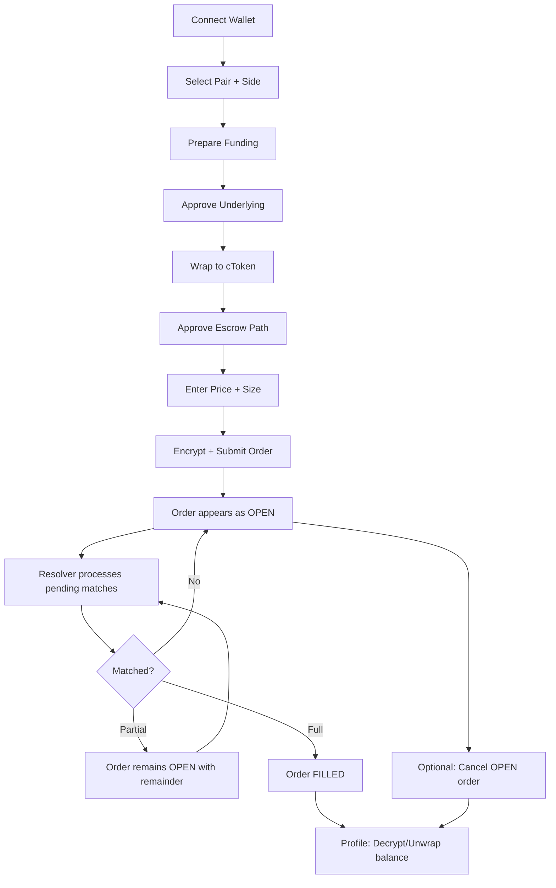
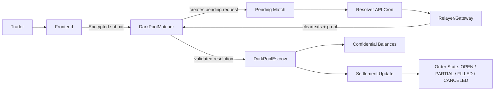
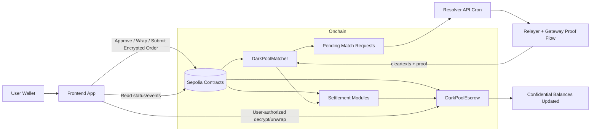

# Blindspot

Blindspot is a confidential dark-pool style spot trading dApp built on Sepolia using Zama FHEVM primitives.  
It enables users to submit encrypted order parameters while matching and settlement are resolved on-chain with proof-backed decryption callbacks.

## Problem Blindspot Solves

Public DeFi execution leaks strategy-critical data before and during execution:

- Order parameters become visible to observers and bots.
- Transaction ordering can be exploited by MEV searchers.
- Large or sensitive flows are hard to execute without signaling intent.

Blindspot addresses this by keeping the **most sensitive trade values encrypted** across order entry and match resolution, while still preserving composability and verifiable on-chain settlement.

## Privacy-First Model

Blindspot is designed so sensitive execution values remain encrypted throughout the lifecycle.

### What stays private

- Order numeric intent (price and size inputs).
- Fill-size arithmetic and remainder computations in match resolution.
- Confidential trading balances held in `cToken` form.
- User-owned confidential value reads, only via wallet-authorized decrypt flow.

### Why this matters

- Reduces direct strategy leakage from public order values.
- Limits intent visibility that typically enables predatory execution behavior.
- Keeps settlement verifiable while protecting sensitive trading parameters.

## Frontend ↔ Contract Flow

This is the exact integration path between UI and smart contracts.

### 1) Pair and side selection

Frontend determines side-specific funding route:

- Buy side -> quote-asset funding path
- Sell side -> base-asset funding path

Then reads matcher/escrow addresses and funding readiness.

### 2) Funding sequence (user-signed txs)

1. Approve underlying token to wrapper
2. Wrap underlying -> confidential token (`cToken`)
3. Approve/allow escrow path for spending

### 3) Encrypted order submission

Frontend encrypts numeric order values client-side and submits encrypted handles:

- buy submit path for buy intent
- sell submit path for sell intent

### 4) Pending request resolution

Resolver API (cron-triggered) scans pending requests and calls matcher `resolveMatchWithProof` using proof payload from relayer/gateway flow.

### 5) Settlement and balance updates

Contracts apply fill math, preserve remainders for partial fills, update statuses, and maintain confidential balance accounting.

### 6) User decrypt + unwrap

Profile flow allows wallet-authorized decrypt and optional unwrap back to underlying ERC-20.

## User Flow (App)



## Trading Engine Flow (Contracts)



## Partial Fill Behavior

Blindspot supports partial fills natively:

- If one side is larger, matcher settles the executable overlap.
- Remaining quantity stays open as remainder on larger order.
- Remainder can match against future counterpart orders.
- If no counterpart is found, order remains open/pending.
- Trader can cancel open orders; contract releases remaining flow accordingly.

This allows many floating orders per pair to be matched progressively over time.

## Public Metadata (Expected on Public Chains)

Some metadata remains public by design of public blockchains:

- wallet addresses
- tx hashes and timestamps
- pair IDs and order IDs
- lifecycle state transitions

Blindspot intentionally keeps these public rails while encrypting the strategy-sensitive numeric layer.

## System Architecture



## Repository Structure

- `contracts/` — Solidity contracts, tests, deployment scripts.
- `src/` — frontend UI (trade, pools, orders, activity, profile).
- `api/resolve-matches.ts` — cron-triggered resolver endpoint.
- `vercel.json` — API deployment configuration.
- `vercel.frontend.json` — frontend-only deployment configuration.

## Deployment Topology

This repository is operated as two Vercel deployments:

1. **API Project (`shadowpool-terminal`)**
   - Hosts `/api/resolve-matches`
   - Holds resolver credentials/secrets

2. **Frontend Project (`shadowpool-frontend`)**
   - Hosts UI only
   - Does not require gateway private key for rendering

## Environment Variables

## API Project (required)

- `CRON_SECRET`
- `SEPOLIA_RPC_URL`
- `GATEWAY_PRIVATE_KEY`
- `GATEWAY_ADDRESS`
- `MATCHER_ADDRESSES` (comma-separated)
- Optional: `MATCHER_MAX_REQUESTS_PER_MATCHER`

## Frontend Project

- Frontend contract/network config values as needed.
- No gateway private key required.

## Cron Configuration

Recommended schedule:

- URL: `https://shadowpool-terminal.vercel.app/api/resolve-matches`
- Method: `GET`
- Header: `Authorization: Bearer <CRON_SECRET>`
- Frequency: every minute (`* * * * *`)

## Local Development

Install:

```bash
npm install
```

Run frontend dev:

```bash
npm run dev
```

Contracts and scripts are managed from `contracts/` using the configured Hardhat workflow.

## Current Scope

Blindspot currently includes:

- confidential order submission,
- pending request resolution pipeline with proof callback,
- partial-fill execution model,
- user-facing funding + decrypt + unwrap paths,
- production-style split between UI and resolver API deployment.

## Reference Concepts

- Zama FHEVM protocol architecture and encrypted input model.
- Ethereum MEV model and transaction-ordering risk context.

